# minio图片上传服务/对象存储服务/OSS(minio)

[](https://github.com/mikuhuyo/minio/blob/master/LICENSE)
[](https://github.com/mikuhuyo/minio/issues)
[](https://github.com/mikuhuyo/minio/stargazers)
[](https://github.com/mikuhuyo/minio/network)


## 前言

现在市面上有那么多的对象存储服务, 可惜大多数或者说全部都需要收费, 我们毕竟是做程序的, 自己写一个对象存储服务问题不大吧?

我裂开了 :)

所需技术: 

1)SpringBoot

2)MinIo

3)SpringTask

4)MapStruct

5)MySQL

6)Redis

## 启动方式

### 环境配置-容器创建

```shell script
# 创建minio容器
docker pull minio/minio

docker run -id -p 9000:9000 -p 9001:9001 --name minio \
--privileged=true \
-e "MINIO_ROOT_USER=yueliminvc@outlook.com" \
-e "MINIO_ROOT_PASSWORD=yueliminvc@outlook.com" \
minio/minio server /data --console-address ":9001"

# 创建redis容器
docker pull redis:4

docker run --name redis -p 6379:6379  \
-d redis:4 \
--requirepass "yueliminvc@outlook.com" \
--appendonly yes
```

### 环境配置-minio配置

> 登录minio(注意, 是你自己的minio容器所在的服务器地址) -> http://192.168.158.160:9001/

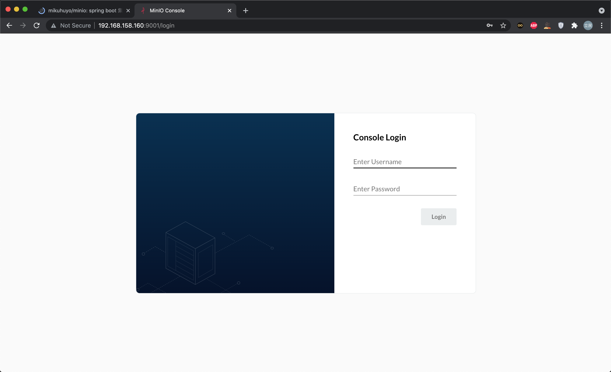

> 创建桶

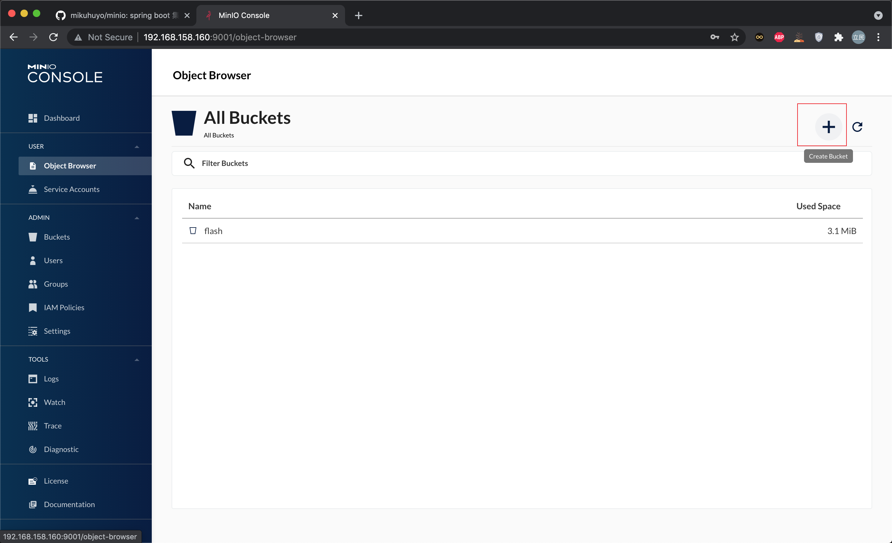

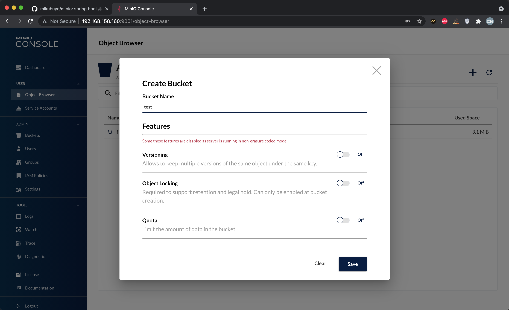

> 配置桶, 将创建的桶改为空开的, 配置可读可写

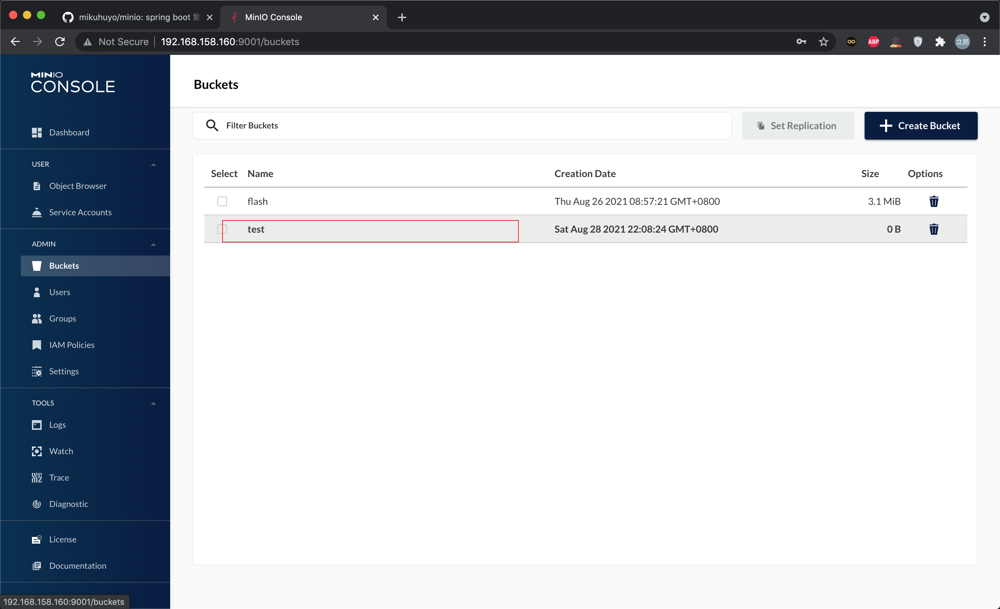

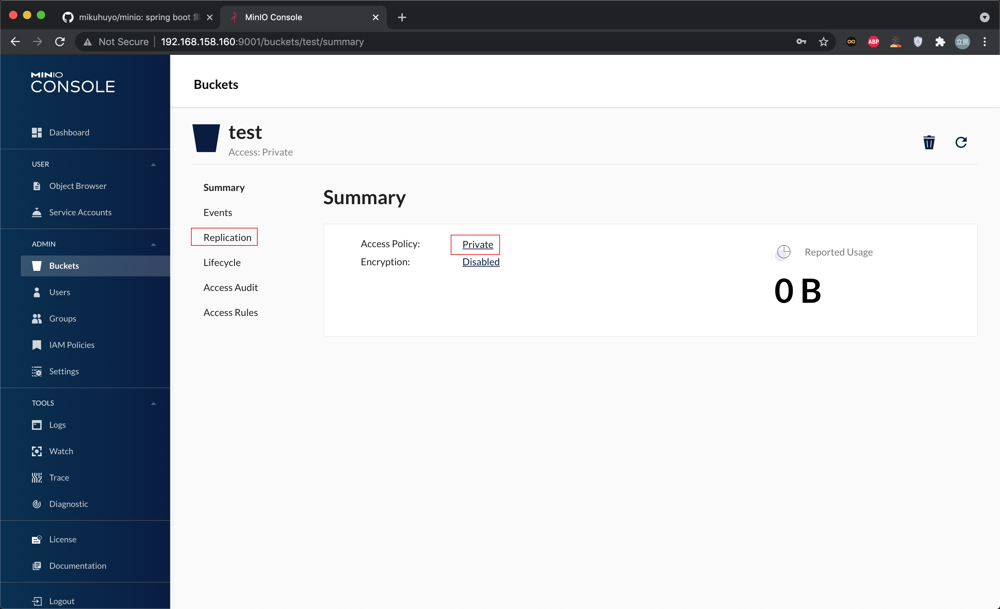

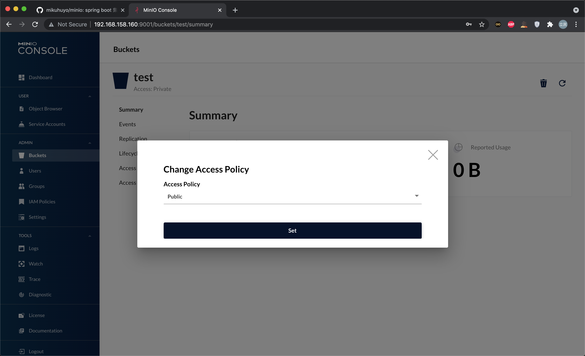

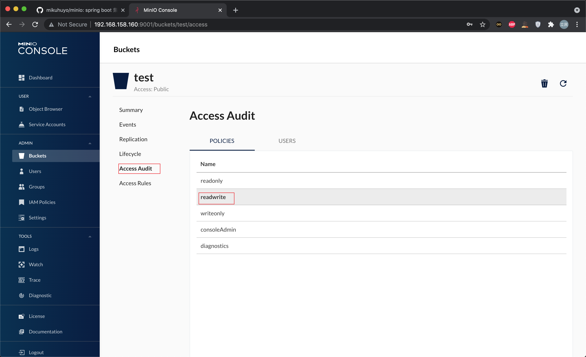

### 环境配置-启动服务

使用`doc/sql/minio.sql`初始化数据库

修改`application-dev.yml`文件中, 关于`MySQL`以及`Redis`的相关配置.

启动`MinIoApplication`.

## 使用手册

接口地址: http://127.0.0.1:56090/minio/swagger-ui.html

> 创建用户签名, 获取签名信息

```json
{
  "flag": true,
  "code": "00000",
  "message": "操作成功",
  "data": {
    "id": "1431622445409304578",
    "username": "miku",
    "password": "$2a$10$xZVjHXLGrC3V154OfVpTGOi823fHYPrhsiKKZ6qnIR9Gg5a.5p..O",
    "appId": "246ad96c4aa9422693d56bf954c2533c",
    "salt": "$2a$10$xZVjHXLGrC3V154OfVpTGO",
    "status": "0"
  }
}
```

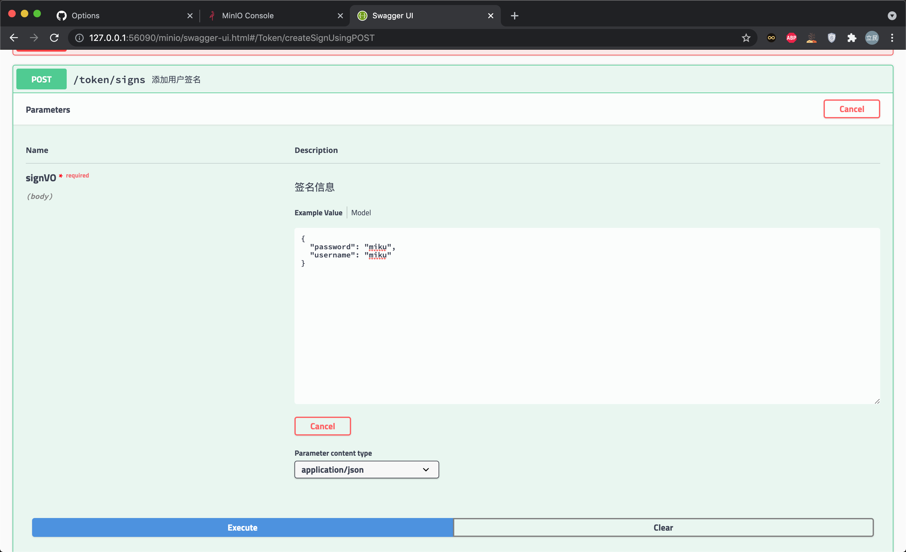

> 根据创建应用id获取加密信息

```json
{
  "flag": true,
  "code": "00000",
  "message": "操作成功",
  "data": {
    "appId": "246ad96c4aa9422693d56bf954c2533c",
    "accessKey": "JDJhJDEwJHhaVmpIWExHckMzVjE1NE9mVnBUR09pODIzZkhZUHJoc2lLS1o2cW5JUjlHZzVhLjVwLi5P",
    "secretKey": "JDJhJDEwJHhaVmpIWExHckMzVjE1NE9mVnBUR094S0NKOEV3WmFtZlpiTWsyWFdqLmxRRGNFRDlLbTlt"
  }
}
```

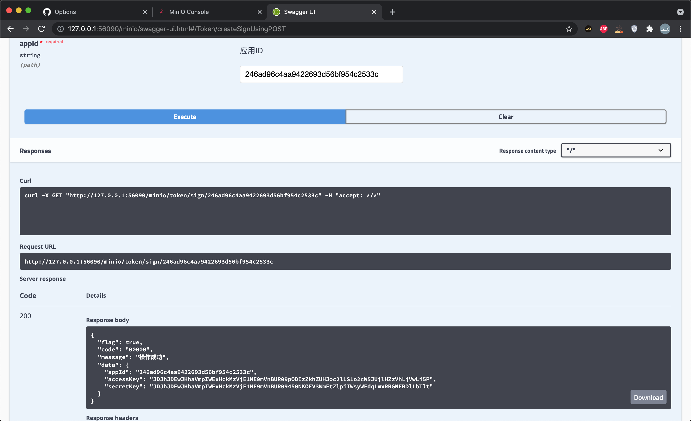

> 添加请求头信息, 上传文件

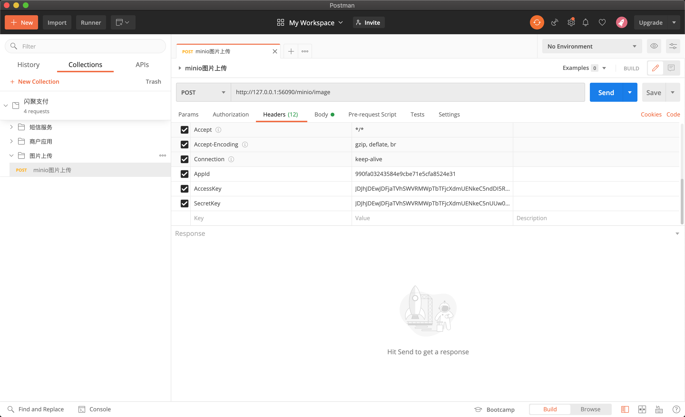

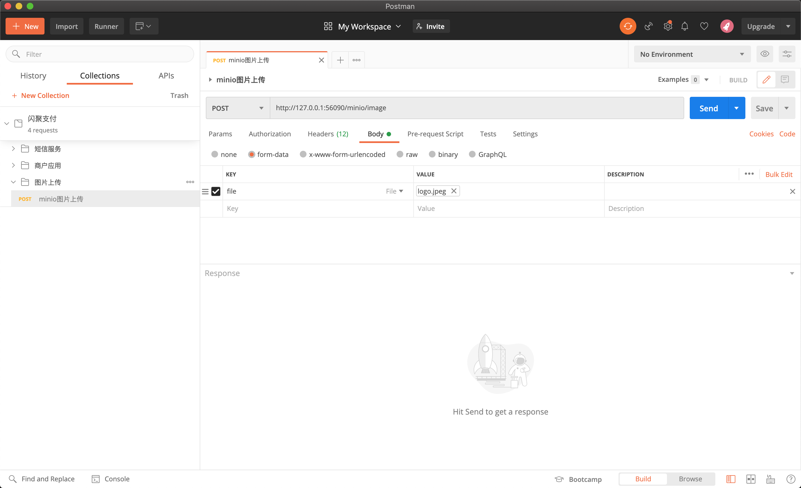

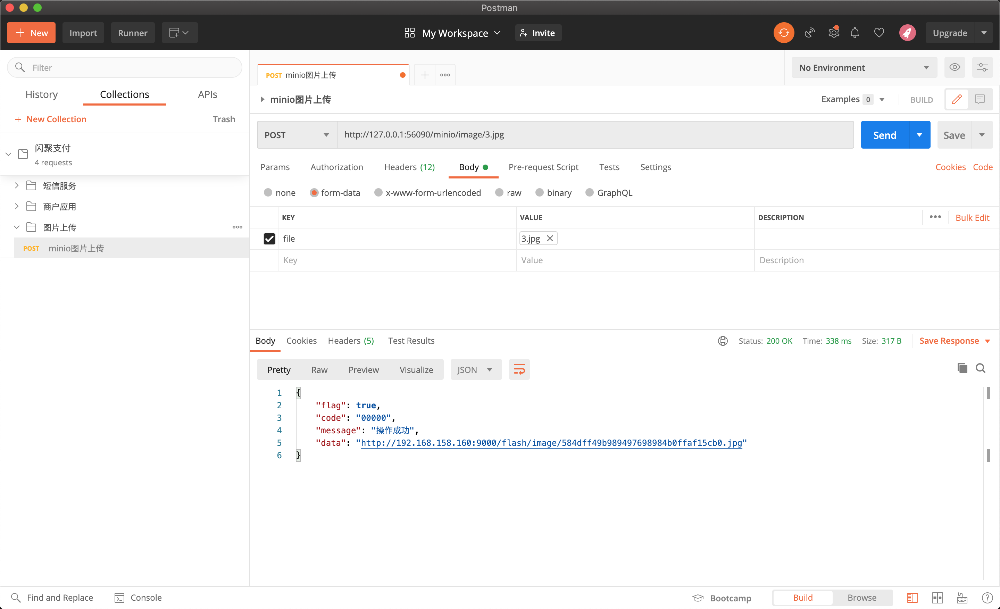

## 特别鸣谢

### 关注者

[](https://github.com/mikuhuyo/minio/stargazers)

### 收藏者

[](https://github.com/mikuhuyo/minio/network/members)

## 整理不易-请这个b喝杯水?


---


